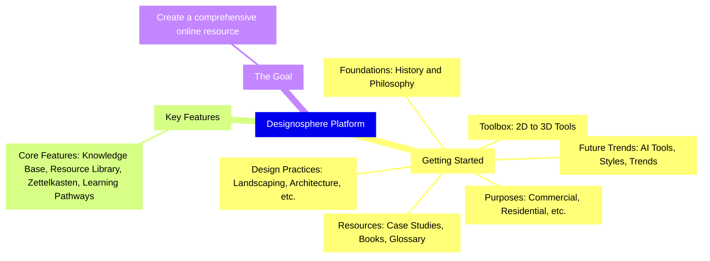

>[!seealso] [[Gioi-Thieu|Read this page in Vietnamese]]

This digital platform serves as a comprehensive guide and database for everyone from professionals to enthusiasts in the realms of interior design, architecture, and landscaping. It embodies a [Zettelkasten](content_en/Zettelkasten%20for%20Architects.md)-like approach to knowledge management, where interconnected notes and ideas form a dynamic and ever-evolving library of [[content_en/Spatial Design/Spatial Design]].

---

## Getting Started

Designosphere is structured around various elements and relationships, contributing to the formation of the spaces we inhabit; from interior to exterior, from lighting to materials, and from human to nature. In each category, details include:

- **The Practice of Design**: This encompasses [landscaping](/content_en/Landscape Design), [architecture](/content_en/Archtecture Design), [interior design](/content_en/Interior Design), [interior styling/decor](/content_en/Interior Styling/Decor), [[content_en/Spatial Design/Spatial Design]], [lighting design](/content_en/Lighting Design), industrial design, conceptualizing and visualizing, and event decor.
    
- **Foundation of the Practice**: An exploration of [[content_en/Architecture/History]] and [[content_vn/Kien-Truc/Triet Hoc]]
    
- **Purpose and Usage**: Categories such as [commercial](/content_en/Commercial Design), [residential](/content_en/Residential Design), [hospitality](/content_en/Hospitality Design), and [events](/content_en/Event Design) are covered.
    
- **The Future of Design**: Discusses [AI](/content_en/AI) tools, new concepts, new styles and trend.
    
- **Toolbox**: Design Principles, 2D and 3D applications with easy guide for designer.
    
- [**Case Studies**](/Content_en/Case Studies): Detailed explorations of specific design projects.
    
- **Recommended Books and Glossary**: Essential readings and a glossary of terms.

>[!hint] Simply type what you're looking for in the search bar to get started.

## Key Features 

- **Expansive Knowledge Base**: This platform offers an extensive collection of resources on spatial design, architecture, and landscaping, curated to support both newcomers and professionals. It includes comprehensive articles, in-depth case studies, and practical tutorials designed to enhance your understanding and skills in various design disciplines.

- **Resource Library**: Gain access to an extensive selection of design tools, software tutorials, and a multimedia library filled with images, diagrams, and videos. These resources are carefully chosen to inspire your creativity and assist in the visualization and execution of your design projects.

- **Interactive Zettelkasten**: Adopting the Zettelkasten method, our platform allows for the creation, linkage, and exploration of notes in a non-linear manner. This approach facilitates a deeper understanding of the complex interconnections within spatial design concepts, encouraging a more holistic and innovative thinking process.

- **Personalized Learning Pathways**: Tailor your educational journey through custom learning tracks that adapt to your interests and proficiency level. Whether you're starting from the basics or looking to specialize in a niche area of design, these pathways guide you through curated content, ensuring a structured and comprehensive learning experience. This feature supports the platform's goal of being an all-encompassing educational tool for designers, enabling users to not only access a wealth of information but also to navigate it in a way that aligns with their personal and professional growth objectives.

## The Goal

Create a space that stores all the information you need and everything you want online for starting your own project or for extended learning. Think of this as a Wikipedia for designers, with personal takeaways included.

>[!quote] "Design is not just what it looks like and feels like. Design is how it works." - Steve Jobs
